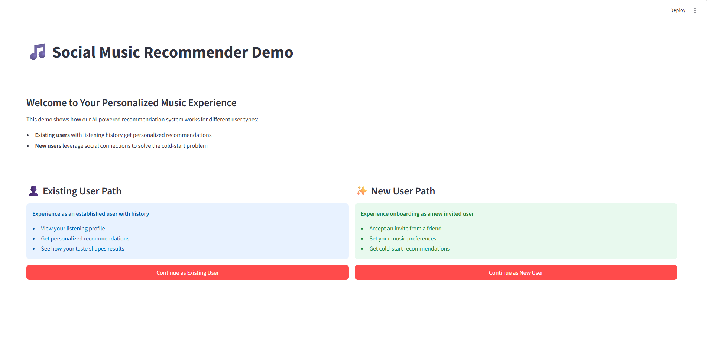
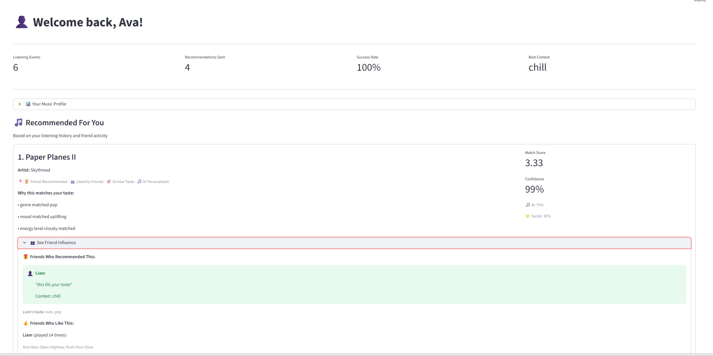
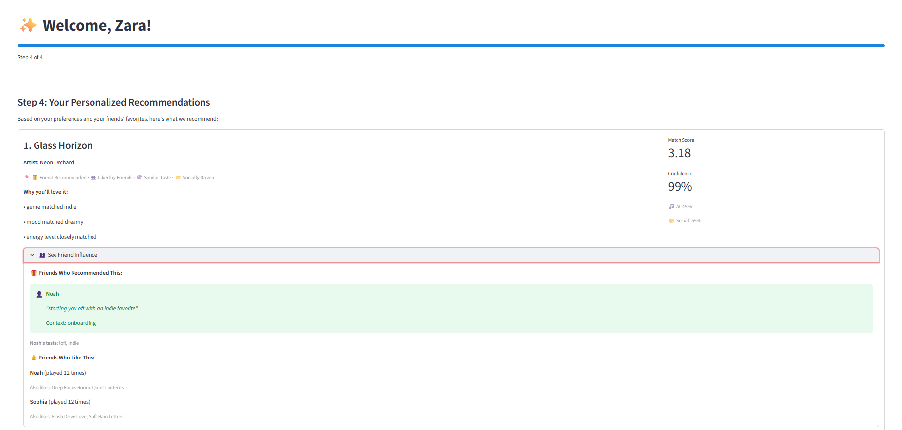
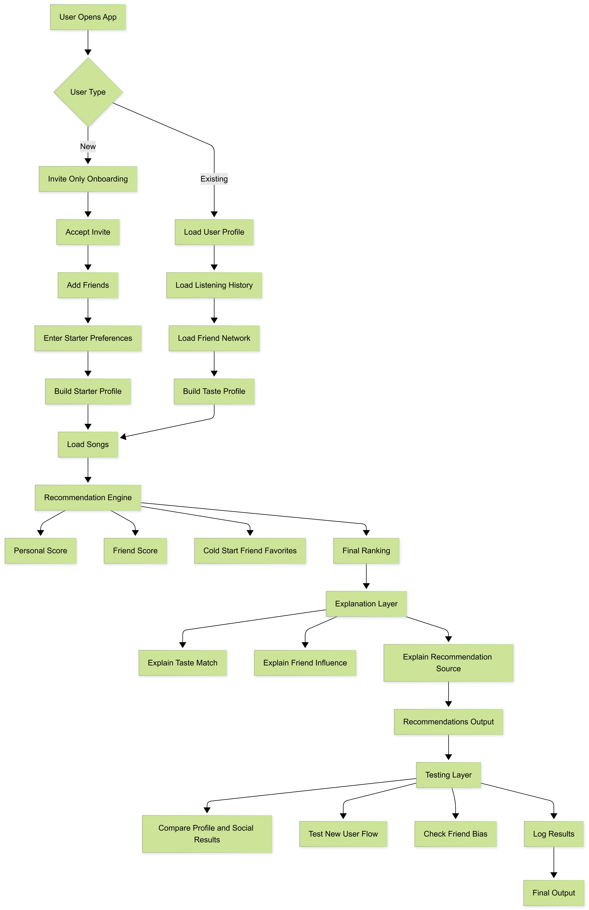

# Social Music Recommender

## Project Summary

This project extends my earlier `Music Recommender Simulation` into an invite-only social recommendation system. The original project ranked songs from a small catalog using features like genre, mood, and energy. This final version adds onboarding for new users, friend-to-friend recommendation signals, explanation output, confidence scoring, and built-in reliability checks so the system is more realistic and easier to evaluate.

The main goal is to recommend songs in two situations:
- for established users with listening history
- for newly invited users who do not have much history yet

For new users, the system falls back to friend favorites and direct friend recommendations to solve the cold-start problem.

## Why It Matters

Real recommender systems rarely rely on one signal. They blend personal taste, past behavior, and social context. This project simulates that idea in a small, explainable Python system and shows how testing can make recommendation behavior more trustworthy.

## Demo Walkthrough

Watch the system in action: [Loom Demo Video](https://www.loom.com/share/9e618cba11474a4a836c5c4d815c6392)

The demo walkthrough shows:
- **Welcome screen**: choose the existing-user or new-user experience
- **Existing user flow**: Ava receives personalized recommendations based on profile and history
- **New user onboarding flow**: Zara joins through the invite-only path and gets cold-start recommendations
- **Step-by-step journey**: accept invite -> set preferences -> connect with friends -> get recommendations
- **Reliability checks**: integrated testing showing the system passes 4 out of 4 checks

Interactive demo:
- Run `streamlit run streamlit_app_enhanced.py` for the guided walkthrough UI
- Run `streamlit run streamlit_app.py` for the simpler comparison UI
- See [DEMO_GUIDE.md](DEMO_GUIDE.md) for detailed walkthrough instructions

### Demo Screenshots

**Initial page**



**Existing user recommendations: Ava**



**New user onboarding recommendations: Zara**



## Required AI Feature

This project uses a `Reliability or Testing System` as its required applied AI feature.

The reliability layer is integrated into the main application flow. After generating recommendations, the system runs checks that verify:
- new invited users receive onboarding recommendations
- established users still get songs aligned with their preferences
- invited users are connected to the friend network
- recommendation records reference valid songs

The recommendation output also includes a confidence score for each result.

## Architecture Overview

The system has two entry paths:
- `Existing user flow`: load profile, listening history, and friend network, then rank songs with personal and social signals
- `New user onboarding flow`: accept an invite, use starter preferences plus friend favorites, then generate cold-start recommendations

Both paths feed into the same recommendation engine. The engine blends:
- a personal taste score
- a friend influence score
- cold-start friend favorites for new users

After ranking songs, the system generates short explanations and then runs reliability checks.

### System Diagram



## How The System Works

### Data Sources

The project uses five CSV files in [data](c:/Users/spingil5/Desktop/AI-3/applied-ai-system-project/data):
- [songs.csv](c:/Users/spingil5/Desktop/AI-3/applied-ai-system-project/data/songs.csv): song catalog with genre, mood, energy, tempo, valence, and duration
- [users.csv](c:/Users/spingil5/Desktop/AI-3/applied-ai-system-project/data/users.csv): user preferences, invite source, and onboarding status
- [friendships.csv](c:/Users/spingil5/Desktop/AI-3/applied-ai-system-project/data/friendships.csv): social graph
- [recommendations.csv](c:/Users/spingil5/Desktop/AI-3/applied-ai-system-project/data/recommendations.csv): direct friend-to-friend song recommendations
- [listening_history.csv](c:/Users/spingil5/Desktop/AI-3/applied-ai-system-project/data/listening_history.csv): plays, likes, and recommendation source

### Recommendation Logic

The main recommender lives in [src/recommender.py](c:/Users/spingil5/Desktop/AI-3/applied-ai-system-project/src/recommender.py).

For each candidate song, the system computes:
- `Personal score`: how well the song matches the user's preferred genres, moods, energy, tempo, and valence
- `Friend score`: whether friends already liked the song, whether a friend directly recommended it, and how similar that friend's taste is to the user
- `Cold-start adjustment`: if a user is new or has very little history, social signals receive more weight

The final output includes:
- ranked song recommendations
- short explanations for why each song matched
- a confidence score
- lightweight user analytics on recommendation success

## Project Structure

```text
applied-ai-system-project/
|-- data/
|   |-- songs.csv
|   |-- users.csv
|   |-- friendships.csv
|   |-- recommendations.csv
|   `-- listening_history.csv
|-- imgs/
|   |-- Initial_Page.png
|   |-- Ava.png
|   `-- Zara.png
|-- assets/
|   `-- system-architecture.png
|-- src/
|   |-- main.py
|   `-- recommender.py
|-- tests/
|   `-- test_recommender.py
|-- streamlit_app.py
|-- streamlit_app_enhanced.py
|-- README.md
|-- model_card.md
`-- requirements.txt
```

## Getting Started

### Setup

1. Create a virtual environment:

```bash
python -m venv .venv
```

2. Activate it:

```bash
source .venv/bin/activate
```

On Windows:

```bash
.venv\Scripts\activate
```

3. Install dependencies:

```bash
pip install -r requirements.txt
```

4. Run the enhanced Streamlit demo UI:

```bash
streamlit run streamlit_app_enhanced.py
```

5. Optional: run the original comparison UI:

```bash
streamlit run streamlit_app.py
```

6. Optional: run the CLI demo:

```bash
python -m src.main
```

### Run Tests

```bash
python -m pytest tests/
```

For verbose output:

```bash
python -m pytest tests/ -v
```

## Sample Interactions

### Example 1: Established User in the UI

Input profile:
- `Ava (u1)`
- preferred genres: `pop`, `edm`
- preferred moods: `uplifting`, `happy`

Sample output:

```text
1. Paper Planes II by Skythread | score=3.33 | confidence=0.99
2. Golden Hourglass by Solar Tide | score=2.87 | confidence=0.99
3. Ultra Motion by Vector Rush | score=2.27 | confidence=0.90
```

Why this is interesting:
- the top results match Ava's preferred genre and mood
- one recommendation is boosted by social influence from a similar friend

### Example 2: New Invited User Onboarding in the UI

Input profile:
- `Zara (u9)`
- onboarding status: `new`
- invited by: `u2`
- limited listening history

Sample output:

```text
1. Glass Horizon by Neon Orchard | score=3.18 | confidence=0.99
2. Soft Rain Letters by Willow Code | score=3.14 | confidence=0.99
3. Quiet Coffee by Soft Ledger | score=2.61 | confidence=0.97
```

Why this is interesting:
- Zara is handled in cold-start mode
- the system uses starter preferences plus friend favorites and social recommendations
- one result is influenced by an anonymous recommendation
- the Streamlit onboarding view shows the join path from invite to recommendation output

### Example 3: Reliability Summary

```text
Reliability checks passed: 4 / 4
- [PASS] new user receives onboarding recommendations
- [PASS] established user gets at least one preferred genre recommendation
- [PASS] friendships exist for every invited user
- [PASS] recommendation rows reference valid songs
```

## Design Decisions

- I kept the system CSV-based so the full data flow is easy to inspect and reproduce.
- I used a weighted rule-based recommender instead of a black-box model so the output stays explainable.
- I added onboarding status and invite relationships because new-user cold start is a real weakness in recommenders.
- I treated reliability as part of the app, not as a separate afterthought, so the system can validate itself every time it runs.

## Testing Summary

Current checks include:
- unit tests in [tests/test_recommender.py](c:/Users/spingil5/Desktop/AI-3/applied-ai-system-project/tests/test_recommender.py)
- confidence scores in recommendation output
- integrated reliability checks in the CLI flow

Latest verified results:
- `4 / 4` tests passed in `pytest`
- `4 / 4` reliability checks passed in the application output

One thing I learned is that recommendation quality can look good even when a system is leaning too hard on one signal. Adding explicit checks for onboarding, data validity, and friend-network coverage made the system easier to trust.

## Limitations and Risks

- The catalog is still small, so recommendation diversity is limited.
- Friend influence can bias the system toward highly active users.
- Genre and mood labels are still hand-written and simplistic.
- Social compatibility is inferred from music behavior, which can overstate how similar two people really are.
- Anonymous recommendations are less interpretable because the user cannot evaluate the source directly.

## Reflection

This project helped me see that a recommender becomes more realistic when it handles missing context instead of assuming perfect data. The onboarding flow made the cold-start problem much clearer, and the reliability layer made me think more carefully about whether the system was working consistently for different user types.

I also learned that explainability matters even in a simple classroom project. A ranked list by itself looks polished, but the real value comes from being able to say why a song appeared, whether a friend influenced it, and how confident the system is in that choice.

## Model Card

See [model_card.md](c:/Users/spingil5/Desktop/AI-3/applied-ai-system-project/model_card.md) for a fuller discussion of limitations, evaluation, and responsible use.
